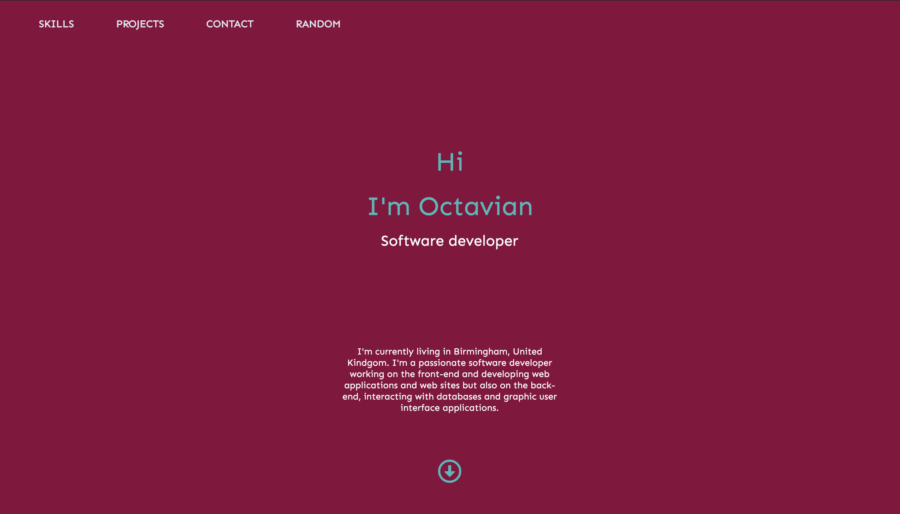

# invite-Me

[](https://standardjs.com)
This is my second version of my portfolio, it is a slick, easy to navigate one page web application.

Available routes:
- `/home`


## Table of contents
* [Technologies](#technologies)
* [Setup](#setup)
* [Used packages and tools](#used-packages-and-tools)


## Technologies

- React.js 
- React Hooks
- React Spring
- Styled Components
- JavaScript ES6
- React Animate On Scroll


## Setup

```bash
  git clone https://github.com/octaviandd/portfolio-v2.git
  npm install
  npm start
```

## Used packages and tools

- Colors.co [Colors Picker](https://coolors.co/)
- Gradients [uIGradients](https://uigradients.com/)


